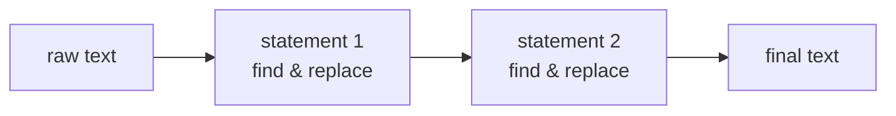
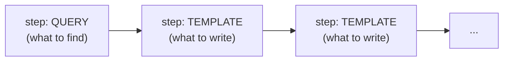
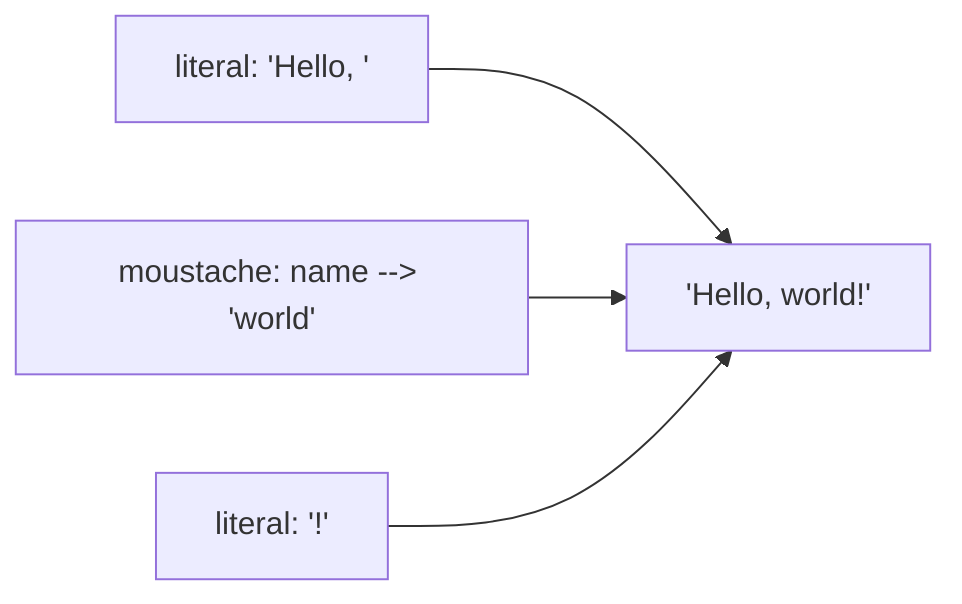

# Building an Engine -- A Friendly Map

So you have a **payload** (see [PAYLOAD.md](PAYLOAD.md)) and you want to *run* it. This guide is the mental model: what an engine actually does, why it's shaped the way it is, and enough of a blueprint that you could write your own in any language. We won't show real code -- just pictures, analogies, and the handful of ideas that matter.

The one-sentence version: **an engine is a find-and-replace machine that understands a very rich notion of "find."** That's it. Everything below is detail hung on that hook.

---

## 1. The factory floor

Picture an assembly line. A document (a big string) rides the conveyor belt. Along the belt sit **stations**, and each station rewrites the document before passing it on.



A payload is a **pipeline**: an ordered list of **statements**. Each statement is a complete find-and-replace pass over the whole document. The output of one statement is the input to the next. Run them in order, return the last result. That outer loop is the easiest part of the whole engine -- a `for` loop over statements.

Inside one statement, there's a smaller line of **steps**:



A step is one of two things, and telling them apart is the whole job of the `kind` field:

- A **query** says *what to find* (a pattern, like a fancy regex).
- A **template** says *what to write* (a string with holes to fill in).

---

## 2. Splicing: the heartbeat

The core move is **splice**: find every place the first step matches, transform each match through the remaining steps, and stitch the pieces back together.

Think of it like editing a sentence. You scan left to right, find each word that matches, and swap it -- but you keep the spaces and punctuation *between* matches untouched.

In pseudocode the splice is just bookkeeping with a cursor:

```
last = 0
out  = ""
for (start, end, replacement) in matches:
    out += target[last : start]   # the gap before this match
    out += replacement            # the rewritten match
    last = end
out += target[last : ]            # the tail after the last match
```

**Fixed-point statements.** Some statements carry a flag meaning "keep splicing until nothing changes" (the document reaches a *fixed point*). Run the splice, compare to the input; if different, run it again on the new text; repeat. Two safety rails matter: cap the number of rounds, and cap the output size -- a rule that grows or oscillates must error out instead of looping forever. The flag lives on the *first step* of the statement -- read `steps[0].fixed_point` rather than a statement-level wrapper.

---

## 3. The matcher: a tiny virtual machine

The interesting part is **find**. A query is a little program: a flat list of **instructions** (we'll call them *opcodes*), run by a tiny VM, much like bytecode. Each opcode tries to match some text starting at the current position; if it succeeds it advances a cursor and hands off to the next instruction.

The opcodes are your instruction set. You don't need to memorise them -- group them by what they consume:

| Family | What it matches | Examples |
|---|---|---|
| **Literal / anchor** | exact text, or a zero-width position | `LIT`, `ANCHOR` (line/doc start & end) |
| **One symbol** | a single position from some set | `CHAR` (code-point range), `GROUP` (an explicit symbol set), `COMPLEMENT` (anything *not* in a set) |
| **Value bands** | a run of symbols read as a number in some base | `VALUE_RANGE`, `DYN_RANGE` |
| **Back-references** | text seen *earlier* in this match or pipeline | `BACK_REF`, `COUNT_REF`, `STAGE_REF` |
| **Grouping** | a sub-program treated as one unit | `SEQ_GROUP` |

The lovely trick: most opcodes share a shape. They all answer the same two questions -- *"does a chunk match here?"* and *"how many times in a row?"* If you build one clean **matcher** abstraction (give me text + position, I return the new position or "no"), every opcode becomes a thin variation on it. Resist writing each opcode from scratch.

---

## 4. Repetition and backtracking -- the part that bites

Almost every opcode ends with a **reps** operand: match this *between min and max times*. `[1,1]` is "exactly once"; `[0,-1]` is "any number, including zero." Sounds simple, but it's where naive engines go wrong.

The danger is **greed**. Suppose a pattern is "one-or-more letters, then the letter `t`" against `cat`. If you greedily grab `cat` as the letters, there's no `t` left and the whole match fails -- even though a *correct* match exists (`ca` + `t`). You must be able to **back up** and try matching fewer repetitions.

```
  "cat"   =  letters+ then 't'

  try 3 letters -> "cat", need 't' next -> nothing left  [x]   back up
  try 2 letters -> "ca",  need 't' next -> "t"           [ok]  success!
```

The clean way to handle this is **continuation-passing**. Instead of each opcode returning a yes/no, it asks: *"if I consume this much, can the rest of the program still succeed?"* It hands the rest of the program (the **continuation**) the candidate end position. If the rest says no, the opcode tries a smaller bite. This turns backtracking into ordinary function calls and recursion -- no manual stack to manage.

```
  matcher(pos):
      for each candidate length, largest first:
          end = pos + length
          result = continuation(end)   # "can the rest succeed from here?"
          if result is not None:
              return result            # this length worked -- done
      return None                      # nothing worked -- caller will back up
```

The closure `continuation(end)` can also be expressed without a closure by passing the full instruction list and an index: call `run(elements, next_idx, end)` instead of `continuation(end)`. This is identical in effect and avoids closure borrow conflicts in languages without garbage collection.

**Tentative writes.** While exploring, an opcode that captures text appends a record, calls the continuation, and -- if the continuation fails -- **removes** that record before trying again. Append, recurse, roll back on failure. Centralise that push/try/rollback dance in one helper; you'll reach for it everywhere.

---

## 5. Captures: remembering what you matched

When a pattern matches, you often need to *remember the pieces* -- for back-references, or to feed them into templates. A **capture** is a little record: the span of text it covered, how many times it repeated, and (for grouped sub-patterns) a list of child captures.

```
  capture
  +-- text:  "cat"
  +-- span:  (4, 7)
  +-- reps:  ["cat"]        <- one repetition
  +-- subs:  [ ... ]        <- nested captures, if this was a group
```

Captures form a tree because groups nest. A **path** like `[0, 1]` means "child 0, then its child 1" -- that's how a template or a back-reference points at a specific piece. Keep them tentative during the search (see section 4) and *finalise* them only once the whole match settles: trim repetition lists to the count that actually won, and re-base spans relative to the match start.

---

## 6. Templates: filling in the blanks

A template step is the *replace* half. It's a list of **parts**, each either a literal string (emit verbatim) or a **moustache** `{{ ... }}` (a small expression you evaluate and substitute).



A moustache expression is a tiny tree with only five node kinds -- interpret it directly, no parsing needed since it's already a tree:

- **literal** -- a constant string.
- **current** (`.`) -- the whole text flowing into this step.
- **reference** -- reach into a capture by stage + path (its text, or its repetition *count*).
- **concat** -- glue several sub-expressions together.
- **filter** -- pass a value through a named transform (the set is closed and tiny, e.g. `trim`, `indent`). An unknown filter means the payload is newer than your engine -- fail loudly.

---

## 7. Stages: how matches flow downstream

Here's the idea that ties query and template steps together. Each step doesn't just transform text -- it hands the *next* step its match, as a **stage**. So later steps can reach back into what earlier steps captured. A moustache reference or a `STAGE_REF` opcode is reading from that history.

```
  step 1 (query)     matches "2024-12-25"          ->  stage[0]
  step 2 (template)  "{{ year }}/{{ month }}"  reads stage[0]'s captures
```

Templates add one twist: a moustache marks **where its value landed** in the output, and that span becomes its own branch flowing into the next step. So a template can carve the document into pieces and route each piece down the rest of the line independently. Track the output spans of each moustache and recurse the remaining steps over each -- that's the whole mechanism. If a template step has no moustache expressions at all, its entire output is treated as one anonymous stage and handed to the next step as a unit -- no branching.

**The committed flag.** When a Program step is running inside an already-matched region -- after a template or another program step has committed to a match -- it should pass through any sub-region where it finds no matches rather than signalling failure. Call this mode `committed`. Set it to `false` at the outermost scan level (a no-match means the match simply does not contribute a delta), and to `true` once any earlier step in the chain has committed to a match (a no-match means pass through unchanged). A Template step always passes `committed=true` to subsequent steps because the template has already emitted its text.

---

## 8. Your build checklist

If you're writing one of these from scratch, here's the order that keeps you sane:

1. **Wire format first.** Read the payload into your own structs. Get the round-trip right (remember: every tuple is just an array, read positionally) before running anything.
2. **The splice loop.** Statements, the cursor-based stitch, fixed-point with size/round caps. Test it with a trivial "match everything, replace with itself" stub.
3. **One matcher abstraction.** Then add opcodes one at a time, easiest first: `LIT`, `ANCHOR`, `CHAR`. Each is a small variation on the matcher.
4. **Reps + backtracking via continuations.** This is the deep end -- get `[1,1]` working, then `[0,-1]`, then the count-set and count-reference forms.
5. **Captures**, tentative-then-finalised. Now back-references light up.
6. **Templates**, then **stages** and moustache branching last.

Test against a reference implementation over a fixed corpus at every step -- an engine is only correct if it produces the *exact* same bytes as the oracle. Build it in this order and each layer rests on a tested one below it.

That's the whole machine: a find-and-replace loop, a tiny matching VM with backtracking, and a template filler -- three ideas, stacked.
