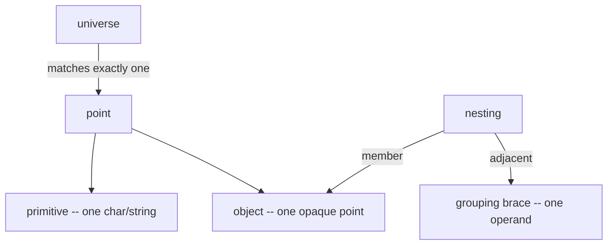

# Himark Specification

**Version:** 0.11.dev | **Status:** Draft | **License:** CC0 1.0 Universal (Public Domain)

<!-- cspell:words himark -->

---

## :jigsaw: Model

A pattern is **universes** plus operators. A universe `{...}` is a set of strings; as a pattern it matches **exactly one** element and fills **one position** -- that is all a brace is. Patterns compose by **adjacency**: universes side by side concatenate (Cartesian product), each adding one position. Everything else writes, narrows, or operates on a universe.

A bare `{...}` is **always an alphabet**; its punctuation picks which set: **literal** `{cat}`, **union** `{a,b}`, **range** `{a..z}`, **band** `{@d:0..9}`. Only a **leading sigil** changes the reading: `!{...}` subtracts, `@name` is a macro/anchor, `$`/`#`+index is a reference.

**Nesting** is the one structural device, split by whether a nested brace is a _member_ or an _adjacent factor_:

- **member** (comma-listed or lone) -> **object**: one position an enclosing operator sees as **one opaque point** -- it can't tell the interchangeable spellings ("faces") apart. `{{a,A}}` is one case-folded position. **Value-bearing** (see [Congruence](#congruence)).
- **adjacent** -> **grouping brace**: packaging so an operator binds the whole sequence. `{of{black}{quartz}}` is one operand. **Content-only** (see [Captures](#captures)).



```proto
{a,A}          // one alphabet, two points: 'a' or 'A'
{{a,A}}        // one object, one position: 'a'/'A' folded to one value
{cat}{dog}     // adjacency: two positions, 'catdog'
{{cat}{dog}}   // grouping: those two as one operand
```

| Operator  | Name            | Role                                                |
| --------- | --------------- | --------------------------------------------------- |
| `{...}`   | Universe        | set of strings; matches one element                 |
| `,`       | Union           | `{a,b}` is `a` or `b`                               |
| `..`      | Range / band    | value band in an alphabet (`{a..z}`, `{@d:0..255}`) |
| `{X}{Y}`  | Adjacency       | concatenate -- Cartesian product                    |
| `!{...}`  | Subtractive     | everything _not_ in `{...}` (ambient Unicode)       |
| `{U:...}` | Alphabet prefix | band over an alphabet (`{@d:0..9}`)                 |
| `[count]` | Repetition      | base-10 count universe (`[n]`, `[x..y]`, `[a,b,c]`) |
| `=>`      | Pipe            | feed each match into the next step                  |
| `<=>`     | Fixed point     | re-apply over the document until it settles         |

A position holds one **point** -- a **primitive** (one char/string) or an **object** (nested, interchangeable members). `[count]` repeats **one point** and is **unidimensional** (it sees only its own level; a nested universe is one opaque object). A primitive repeats its fixed spelling; an object's faces are **free per position** (the operator never sees which face it stamps):

```proto
{a,b}[..]    // 'aa...' or 'bb...' -- primitive, one spelling repeated
{{a,b}}[..]  // any run of a's and b's -- object, free per position
{a,A}[2]     // 'aa', 'AA'
{{a,A}}[2]   // 'aa','aA','Aa','AA'
```

Point **value** is fixed under [Values and ordering](#values-and-ordering).

---

## Macros

| Name     | Expands to                     |
| -------- | ------------------------------ |
| `@d`     | `0..9`                         |
| `@l`     | `a..z`                         |
| `@u`     | `A..Z`                         |
| `@s`     | `\n,\r, ,\t`                   |
| `@w`     | `0..9,{a,A},{b,B},...,{z,Z},_` |
| `@hex`   | `{@w:0..f}`                    |
| `@b256`  | `U+0000..U+00FF` (every byte)  |
| `@ascii` | `U+0000..U+007F`               |
| `@uni`   | `U+0000..U+10FFFF`             |

---

## :anchor: Anchors

Zero-width, capture the empty string:

| Anchor        | Matches                                              |
| ------------- | ---------------------------------------------------- |
| `@^` / `@$`   | start / end of **line** (pos 0 or by `\n`)           |
| `@^^` / `@$$` | start / end of **scope** (text a stage sees)         |
| `@<` / `@>`   | start / end of **word** (`@w` <-> non-`@w` boundary) |

A whole word is `{@<}{@w}[1..]{@>}`.

---

## Escaping

Backslash makes the next char literal. Only **framing** chars ever need it: `{` `}` `[` `]` `"` `\`, plus `:` `$` `#` where they'd read as a band separator or reference. All else (`(` `)` `.` `*` `+` `-` `?` `|` ...) is already literal. Invisibles use C spellings `\n` `\r` `\t`; a space is a space. So `{(a|b)?}` matches the literal `(a|b)?`.

---

## Universes

`,` unions atoms, `..` bounds them into an ordered range, adjacency concatenates (Cartesian product). A universe matches **one** element; a run is an explicit `[count]`.

```proto
{a,b,c}        // a or b or c
{aa..zz}       // every string 'aa'..'zz' by value (Unicode)
{a..z}{A..Z}   // adjacency: aA,aB,...,zZ
```

> `..` is **one-axis**. `{a..z}..{A..Z}` (range between two sets) has no single order -> rejected; write `{a..z}{A..Z}` (product), `{a..z,A..Z}` (either case), or `{{a,A},...,{z,Z}}` (folded).

> An unnamed multi-char range is over **ambient Unicode**: `{aa..zz}` is the value band, including non-letter strings between. For "two lowercase letters": `{@l:aa..zz}`.

### Congruence

A bare `,` **lists points** the enclosing context can tell apart: `{a,b}` = `{a..b}`, two primitives. **Nesting hides the choice.** A `{...}` used as a _member_ becomes an **object** -- opaque to whatever encloses it, which sees one point and can't distinguish its faces. That indistinguishability _is_ congruence: to a value operator the faces share one ordinal; under `[count]` they're free per position, because the operator never sees which face it stamps.

```proto
{{a,A}}                       // one position, 'a' or 'A'
{{color,colour},{gray,grey}}  // faces can be strings
```

> Congruence is brace depth: `{a,A}` two primitives an operator picks between, `{{a,A}}` one position it can't see into. `{@w}` nests where it folds (`{0..9,{a,A},...,_}`), so `@w`/`@hex` are case-insensitive.

---

## Values and ordering

Bands, counts, references, and arithmetic all read **value**. An alphabet is an **ordered sequence of points** with an **increment** (successor) and **equality**. Each point has a 0-based **ordinal** (its index in the alphabet in force -- a band's prefix, else ambient `@uni`). An **object** is opaque to a value operator -- its faces share one ordinal, so all spellings compare equal.

A single point's value is its ordinal. A string $p_0 \ldots p_{k-1}$ over alphabet size $b$ is positional, most-significant-first:

$$\text{value} = \sum_{i} \text{ordinal}(p_i) \cdot b^{k-1-i}$$

Over `@d` `255`=255; over `@l` `aa`=0, `zz`=675. Comparison is **by ordinal, never raw codepoint** (they coincide only for `@uni`, `@ascii`, `@b256`). This is why `@w` slices: ordinals put `a/A`=10 ... `f/F`=15 ... `z/Z`=35, `_`=36, so `0..f` is ordinals 0--15 and stops below `_`.

**A capture is `<alphabet, range, value>`** -- the alphabet matched under (codec), the range in force (band, which fixes **width**), the value (ordinal). The value is what arithmetic reads.

Two **projections**:

- **text** -- value rendered back through its alphabet (codec + width); what `{{ $i }}` produces.
- **bytes** -- value in big-endian base-256, width from the range (inverse: `uint`); what `b256`/`sha256` consume.

A **named** alphabet makes value meaningful: `{@d}` on "11" is integer 11; bare `{0..9}` on "11" is codepoints 49,49. `{@d}`"11" and `{@l}`"l" are both value 11 (different base/width, same value).

> **Matching position is concrete text** -- the triple is a template/value-time view. A reference re-matches the **exact text**: `{{a,A}}{$0}` matches `aa` or `AA`, never `aA`.

---

## :symbols: Carriers and operators

Values are integers: `Z` is the carrier of every alphabet (`@d`, `@l`, `@hex`, the byte alphabets), and a **ring**, so the operators are integer `+` (add) and `*` (multiply). A computed result has **no alphabet**, so it needs a **render-cast**: `Z` defaults to `@d`, `| @hex` re-codecs. (`7 + 8` -> value 15, "15".)

> **Carrier is the extension hook.** Each alphabet's carrier is fixed at compile time. Today every carrier is `Z`, so `*` has one meaning and there is nothing to disambiguate. A future **library alphabet** (a curve group, say) could carry its own algebra -- overloading `*` as a scalar action against ring multiply -- with cross-carrier misuse caught as a compile-time error.

---

## Bands

A **band** restricts an alphabet's values. The alphabet is the **payload** (any universe); `:` adds a band -- a `..` range, a `,`-union of ranges/values, or a single value, over the alphabet's values. `{U:x..y}` restricts **inclusively** to values `x`..`y` by [value](#values-and-ordering) (MSB-first). Drop the prefix for an ambient band (`{0..255}`); drop the band for the bare alphabet (`{@d}`).

```proto
{@d:0..255}        // decimal 0--255
{@d:5}             // single value '5' over a typed head
{a,b,g..z:m..p}    // bare alphabet, banded m--p
{0..9:9..12,1..5}  // union: 1,2,3,4,5,9,10,11,12
```

**When `:` separates.** A brace is a band only if its head is a `@macro` or braced universe (`{@d:5}`, `{{a..z}:b}`), or a top-level `:` is followed by **band syntax** -- a `..` range on its right (`{a..z:b..y}`). That first `:` splits payload (left) from band (right); every other `:` is **literal**, so `{12:30}`, `{std::vector}`, `{https://x.com}` need no escape. Use `\:` to force a literal colon.

> A single-value or union band needs a **typed head**: `{@d:5}` is `5` over `@d`, `{@d:1,3,5}` the set {1,3,5}. Over a bare range a lone value just restates a literal -- `{a..z:b}` is the string `a..z:b` (write `{b}`); only a band-side `..` makes a bare head a band.

Either endpoint may be omitted (`{@d:0..}` is $\geq 0$, `{@d:..255}` is $\leq 255$); **both** omitted is a compile error (write `{@d}`).

A band's **width follows endpoint widths**: `{@d:00..99}` is two wide, `{@d:000..999}` three, `{@d:0..999}` one-to-three (narrower endpoint = min, wider = max). For a fixed width regardless of value use a count (`{@d}[3]`); to **produce** padded output use `pad` -- padding is never inferred from a bound's spelling.

An endpoint is a value, so a **reference** may stand in, resolved at match time by magnitude: `{@d:0..$0}` matches a decimal $\leq$ group 0 (width-agnostic -- more positions than the referent is larger), `{@d:$0..}` matches one $\geq$ it. A reference that didn't capture, or a referent outside the alphabet, does not resolve. `\$` is literal.

```proto
{@d}[1..],{@d:0..$0}    // two decimals, second <= first
```

### Subtraction

`!{...}` is the **subtractive universe**: one char that does **not begin any member of `{...}` at this position**. Plain complement is the one-char case (`!{a}` = any char but `a`); a union applies each member's condition. A **multi-char** member is a **break**: `!{ab}` is to `!{a,b}` as `{ab}` is to `{a,b}` -- comma lists members, adjacency makes one member. So a run `!{```}[1..]` stops at the **nearest** sequence -- scanning to a delimiter with no lazy operator:

```proto
{@d,@l,@u,!{0,l,I,O}}   // base58: digits + letters minus four ambiguous chars
{<!--}!{-->}[1..]{-->}   // HTML comment: body runs to the nearest -->
```

> A break is **not** per-char exclusion -- `!{()}` passes a lone `(` or `)`, stopping only before the sequence `()`. To exclude either: `!{(,)}`.

---

## Repetition

`[count]` repeats the preceding universe. The count is itself a **universe** over **base-10 non-negative integers**: bare = exact, `,` unions, `..` ranges; an omitted floor = **0**, an omitted ceiling = unbounded.

| Form      | Meaning          |
| --------- | ---------------- |
| `[n]`     | exactly `n`      |
| `[x..]`   | `x` or more      |
| `[..y]`   | 0 up to `y`      |
| `[x..y]`  | `x` to `y`       |
| `[..]`    | zero or more     |
| `[a,b,c]` | `a`, `b`, or `c` |

Only the integer operators apply: adjacency is meaningless, and a non-integer count (`[a..z]`, `[!{@s}]`) is a compile error. References fit: `[#i]` repeats as group `i` did, `[#0..#1]` ranges between two captured counts.

A run is **greedy**: it takes the longest count in range that still lets the rest match, backing toward the floor if the tail fails (no further than `x` for `[x..y]`) -- so `!{ }[1..]` is a whole word. No lazy operator: to stop at the **nearest** delimiter, subtract it.

`[n]` repeats **one point**: a primitive verbatim (`{a..z}[3]`=`aaa`), an object's members free (`{{a..z}}[3]` = any three letters). An **alphabet of objects** stays within one object: `{{a,A},{c,C}}[2]` is `{a,A}{a,A}` or `{c,C}{c,C}`, never a cross like `ac`. A **grouping brace** under `[count]` matches a **fresh instance per repetition**, captured as one string.

```proto
{a..z}[2,4,6]               // same letter 2, 4, or 6 times
{{|}!{|,\n}[1..]}[2..]{|}   // 2+ '|'+cell units, each cell different
```

---

## Captures

Every `{...}` in matching position is a **capture group**, numbered from **0** in source order (assigned when the opening brace is read). Numbering is **flat** -- each group takes the next number.

A **grouping brace** (a body that concatenates constructs) captures its full text as **one** group, one number; its inner braces aren't numbered (the same collapse `[count]` performs). A **bare** grouping brace is `{...}[1]`: `{1{am,pm}}` captures `1am`/`1pm` as one `$0`, where `{1}{am,pm}` captures the same text as two. Capture shape only. (`{1{am,pm}}` is alternation in a unit; folding the inner to `{1{{am,pm}}}` changes nothing observable -- a brace buried in a grouping brace is never addressed or repeated on its own, so object vs. union there is moot.)

Single-position constructs -- object `{{a,A}}`, band `{A:x..y}`, subtractive `!{...}`, reference, anchor `{@^}` -- are each **one** group regardless of inner braces. An anchor occupies a number and captures the empty string. A repeated group `{X}[n]` is one number, captured as one string.

Input `### Sphinxofblackquartz`, expression `{#}[1..]{ }{Sphinx}{of{black}{quartz}}`:

| Group | Text                      | Why                                         |
| ----- | ------------------------- | ------------------------------------------- |
| full  | `### Sphinxofblackquartz` | full match                                  |
| 0     | `###`                     | `{#}[1..]`                                  |
| 1     | space                     | `{ }` is a group                            |
| 2     | `Sphinx`                  | `{Sphinx}`                                  |
| 3     | `ofblackquartz`           | `{of{black}{quartz}}` grouping brace, whole |

> Group 3's inner `{black}`/`{quartz}` are structural, unnumbered (next sibling = `4`). To address separately, lift to top level: `{of}{black}{quartz}` -> `3,4,5`.

> Templates address captures via `{{ [stage]$[index] }}`: `{{ $ }}` current stage whole, `{{ $j }}` its group `j`, `{{ i$ }}` stage `i` whole, `{{ i$j }}` stage `i` group `j`.

### Self-references

A reference: optional **stage** (a leading number), **sigil** (`$` text, `#` count), optional **index** `i`. Groups 0-based in document order.

| Form             | Reads                                                     |
| ---------------- | --------------------------------------------------------- |
| `{$i}` / `{N$i}` | the **text** of group `i` -- current match, or stage `N`  |
| `{#i}` / `{N#i}` | the **count** of group `i` -- current match, or stage `N` |
| `{N$}`           | stage `N`'s **whole** text (a raw string)                 |
| `[#i]` / `[N#i]` | (in a count) repeat as group `i` did                      |

```proto
{a..z}{$0}        // doubled letter: 'aa','bb' (not 'ab')
{a}[2..]{-}[#0]   // as many '-' as 'a': 'aaa---','aa--'
```

An index names a **top-level group** of the addressed step, resolved at **compile time** (an index naming no group is a compile error). At match time, a reference whose group exists but didn't capture (an unmatched alternative, a zero-count run) **does not match**. A bare `$`/`#` is literal (`\$` to be explicit); a sigil is a reference only with a stage or index, so `{#}` is `#` and `{#0}` is group 0's count.

> In **matching** position a reference is concrete text; the text-vs-value distinction matters only in **template** position, where a filter may consume it.

---

## :repeat: Transformers

`=>` runs a chain of steps -- each a **query** (matcher) or a **template** (plain text, no matchable `{...}`); the first is a query. Each match of the first query starts a **branch**, transformed independently. A branch outputs **whatever it commits**:

- a **query** matches within the branch and commits each transform in place, keeping the text between. A query that matches nothing **stops** the branch (no output) -- so a leading query is a **guard**. To gate on a _computed_ value, a template emits it and a following query re-matches it (`{$0}` for equality, `{@d:0..$0}` for magnitude).
- a **template** renders and **commits** (never rolled back) and is **not** terminal: a later query matches the rendered text, a later template wraps it. `$` is the flowing text, so templates compose.

A template is literal text plus `{{ ... }}` moustaches. The full render **lands**; what **flows** to the next stage is the concatenation of moustache contents alone. Text outside the braces decorates (lands, never flows). So `"<h{{#0}}>{{$2}}</h{{#0}}>"` flows `#0+$2+#0`, while `"{{ ("<h", #0, ">", $2, "</h", #0, ">") }}"` flows the whole render.

Stages are numbered by `=>` position, **counting queries only** (a template doesn't advance the count), so `{{ i$j }}` and `{N$i}` stay stable when a template is inserted.

A statement's result is **(span, output)** pairs. The semantics is **splice**: every statement, at every depth, lays its outputs back over their spans and keeps the text between -- which lets templates compose, branches nest, and `<=>` iterate. A flat **list** (spans dropped) is a **host projection** for extraction, not a second semantics.

```proto
"# Hello" => {#}[1..6]{ }[1..]!{\n}[1..] => "<h{{#0}}>{{$2}}</h{{#0}}>"
// lands "<h1>Hello</h1>"
{@d:0..}{=}{$0} => "ok"
// gate: '7=7' passes, '7=8' is dropped
```

### Fixed point

`<=>` instead of `=>` **re-splices over the whole document until the result stops changing** -- the splice version of a `while` loop. Each pass is an ordinary `=>` splice; passes repeat until one makes no change. Use it for input-dependent iteration: peel the innermost tag pair, mask an interior newline, swap an out-of-order pair until sorted.

```proto
{(}!{(,)}[..]{)} <=> "{{$1}}"              // strip innermost (...), deepest first
{@d:0..},{@d:0..$0}, <=> "{{$1}},{{$0}},"  // bubble-sort: swap adjacent out-of-order pairs
```

The rule must **contract** toward a fixed point; one that grows the document (`{a} <=> "aa"`) or oscillates never settles. The runner halts on a pass that lengthens or repeats a state; a provably non-contracting rule is rejected at compile time. Use `=>` for a single pass. `<=>` is an arrow only at top level; only a single statement can be looped, not a whole group.

### Expressions

A `{{ ... }}` moustache holds one **expression** over captured values. What **flows** is every moustache's value concatenated. Operands: accessors (`$`, `$i`, `#i`, `i$j`), integer/string literals, and parentheses. Operators, tightest to loosest:

- `*` -- multiply
- `+` -- add (integer or point)
- `|` -- filter pipe (applies to everything on its left)
- `,` -- concatenate, **inside parentheses only**

All left-associative; parens override. So `("<h", #0, ">")` is one value, and `$0 + $2 | b256` = `($0 + $2) | b256`; to filter one operand first, parenthesize: `($h | uint(le)) * 256`. Carrier typing applies; a computed result is render-cast. The `{{`/`}}` boundaries set the expression context, so quotes inside are string delimiters.

### Filters

A moustache value may be piped through **filters** -- a fixed library of pure, deterministic transforms: `{{ accessor | f | g }}`. Filters are **template-only**, so the matcher stays declarative.

A value is either a **value** (a named-alphabet capture, carrying alphabet/range/value) or a **raw string** (a whole-stage `{{ i$ }}`, the flowing `{{ $ }}`, any string-filter output, a bare-Unicode-range or subtractive capture). **String** filters read either; a **value** filter or arithmetic on a raw string is a compile error.

| Filter              | Kind   | Effect                                                                                                   |
| ------------------- | ------ | -------------------------------------------------------------------------------------------------------- |
| `sha256`            | string | SHA-256 of the byte string (32 bytes)                                                                    |
| `sha512`            | string | SHA-512 (64 bytes)                                                                                       |
| `pad(n)`            | string | left-pad with `0` to width `n`                                                                           |
| `b256` / `b256(n)`  | value  | value as base-256 bytes, big-endian (`b256(le)` little); width from band high endpoint, or forced by `n` |
| `uint` / `uint(le)` | string | byte string -> unsigned integer, big-endian (`le` little) -- inverse of `b256`                           |

Byte filters work one byte per code point, so they chain (`... | b256 | sha256`). A bare `b256` takes its width from the band's **high endpoint** (`{@d:0..255}`=1 byte, `{@d:000..999}` and `{@l:aa..zz}`=2); pass `b256(n)` for an open/wider band. `b256` needs a value; on a raw string it errors. `uint` is its inverse (byte string -> `Z`, render-cast applies). Both default big-endian; match endianness to round-trip -- `v | b256(n) | uint` = `v`.

No slice filters -- adjacency and counts already cut a byte string by position. Emit with `b256`, then a query slices: `{{@b256}}[21]{{@b256}}[4]` captures a 25-byte body `$0` and checksum `$1` (use the object form; `{@b256}[n]` repeats one byte). A prefix test needs no slice: `{$1}{{@b256}}[..]` matches a digest only when it **begins with** that checksum -- how Base58Check verifies without ever taking the first four bytes.
